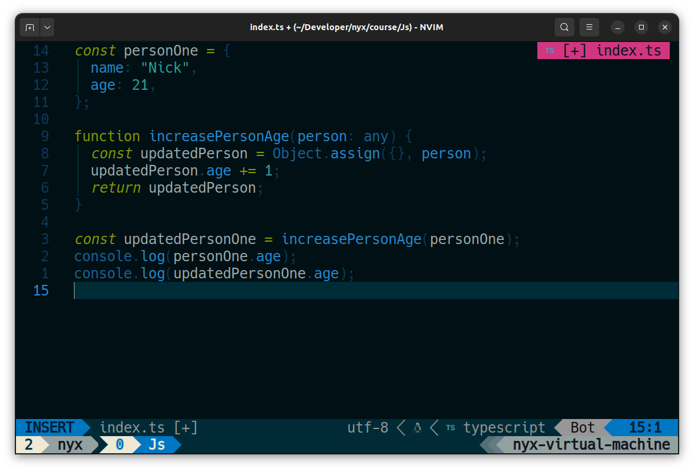

# 🏯 Solarized Nyx



## 🎨 More Colors

Ethan Schoonover originally created the [Solarized](https://en.wikipedia.org/wiki/Solarized) color scheme in 2011, featuring a set of 16 colors.
However, this assortment of colors falls short in providing adequate variations for additional signs, alerts, tooltips, and various other UI components made available by recent Neovim plugins.
Furthermore, the text colors in the original theme are somewhat too dark when displayed on modern, vibrant monitors.

Solarized Nyx improves upon this by introducing additional colors, enriching the overall theme to ensure compatibility with newer plugins and enhancing visibility on contemporary monitors.
The theme brightens the base colors slightly, creating a visually appealing and functional color palette.

Here is what the improved color palette looks like:


## ✨ Features

- Supports the latest [Neovim](https://github.com/neovim/neovim)
  [0.9.0](https://github.com/neovim/neovim/releases/tag/v0.9.0) features.
- Enhances terminal colors.
- Introduces a darker background option for sidebar-like windows.
- Supports all major plugins.

## ⚡️ Requirements

- [Neovim](https://github.com/neovim/neovim) >=
  [0.7.2](https://github.com/neovim/neovim/releases/tag/v0.7.2)

## 📦 Installation

Install the theme with your preferred package manager, such as
[folke/lazy.nvim](https://github.com/folke/lazy.nvim):

```lua
{
  "NickFineSmarty/solarized-nyx.nvim",
  lazy = false,
  priority = 1000,
  opts = {},
}
```

## 🚀 Usage

### Vim Script

```vim
colorscheme solarized-nyx
```

### [Lua](https://www.lua.org)

```lua
vim.cmd[[colorscheme solarized-nyx]]
```

## ⚙️ Configuration

> ❗️ Set the configuration **BEFORE** loading the color scheme with `colorscheme solarized-nyx`.

## 🪓 Overriding Colors & Highlight Groups

How the highlight groups are calculated:

1. `colors` are determined based on your configuration, with the ability to
   override them using `config.on_colors(colors)`.
1. These `colors` are utilized to generate the highlight groups.
1. `config.on_highlights(highlights, colors)` can be used to override highlight
   groups.

For default values of `colors` and `highlights`, please consult the
[colors.lua](lua/solarized-nyx/colors.lua) file.

### [Borderless Telescope](https://github.com/nvim-telescope/telescope.nvim/wiki/Gallery#borderless) example

```sh
# Undercurl
set -g default-terminal "${TERM}"
set -as terminal-overrides ',*:Smulx=\E[4::%p1%dm'  # undercurl support
set -as terminal-overrides ',*:Setulc=\E[58::2::%p1%{65536}%/%d::%p1%{256}%/%{255}%&%d::%p1%{255}%&%d%;m'  # underscore colours - needs tmux-3.0
```
